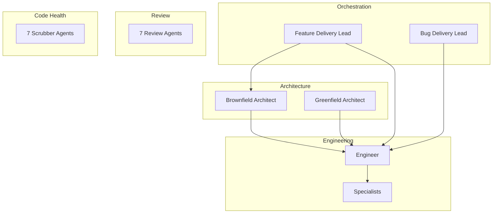
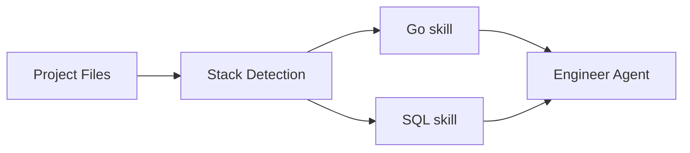

# Agents & Skills

Hero ships with 34 specialized agents and 45 skills. Agents are roles with defined responsibilities and boundaries. Skills are domain knowledge loaded dynamically based on context.

## Agent Organization

### Orchestration

Delivery leads coordinate the workflow. They read specs, break down tasks, delegate to specialists, and verify results.

!!! warning "Delivery leads never write code"
    They plan, coordinate, and verify — but all code changes are made by engineering agents. This separation prevents the orchestrator from cutting corners.

### Architecture

| Agent | Role |
|---|---|
| Brownfield Architect | Works within existing codebases — respects current patterns, minimizes disruption |
| Greenfield Architect | Designs new systems from scratch — picks patterns, defines structure |

### Engineering

The **engineer** agent is the primary code-writing agent. It auto-detects the project's stack and loads the appropriate language-specific skills.

Specialists handle narrow domains (database migrations, API design, infrastructure, etc.) and are called in by delivery leads when needed.

### Review (Read-Only)

Seven review agents cover different aspects of code quality:

- Correctness and logic
- Security
- Performance
- Test coverage
- API design
- Documentation
- Conventions compliance

!!! info "All review agents are read-only"
    Review agents analyze and report — they never modify files. This makes them safe to run at any point without risk of unintended changes.

### Code Health

Seven scrubber agents (invoked via `/scrub`) target specific code health issues:

- Dead code removal
- Duplication detection
- Weak type strengthening
- Slop cleanup (AI-generated boilerplate)
- Import organization
- Error handling improvement
- Naming consistency

## Skills

Skills are instruction sets loaded dynamically based on what the agent is working on. Hero includes 45 skills across four categories:

| Category | Examples |
|---|---|
| **Workflow** | Spec authoring, code review process, delivery verification |
| **Principles** | SOLID, testing strategies, API design guidelines |
| **Language / Framework** | Go, TypeScript, React, Next.js, Python, Rust |
| **Domain** | Auth patterns, billing systems, data pipelines |

### Dynamic Loading

Skills are not pre-loaded. When the engineer agent starts work, it inspects the project (languages, frameworks, config files) and loads only the relevant skills. A Go project with PostgreSQL gets Go + SQL skills. A React + TypeScript project gets TypeScript + React skills.

This keeps context focused and avoids wasting token budget on irrelevant instructions.
