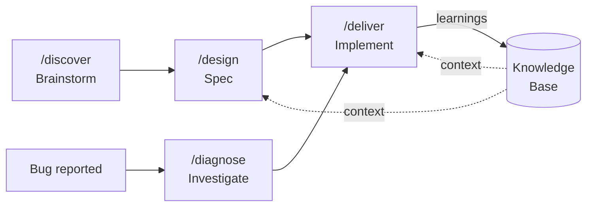

# The Core Loop

Hero's workflow revolves around a single principle: **specs before code**. Every change — feature, fix, or refactor — flows through a structured loop that keeps humans in control and agents productive.

## The Loop

### Features

1. **`/discover`** — Brainstorm and explore. Generate ideas, evaluate approaches, map out possibilities. No commitment yet.
2. **`/design`** — Produce a spec. The spec captures what to build, why, acceptance criteria, and technical approach. It goes through human review before any code is written.
3. **`/deliver`** — Implement from the approved spec. The agent follows the spec, writes code, runs tests, and verifies against the acceptance criteria.

### Bugs

1. **`/diagnose`** — Investigate the bug. Reproduce it, trace the root cause, and produce a fix spec with a concrete plan.
2. **`/deliver`** — Implement the fix from the diagnosis spec.

## Specs Are the Core Artifact

Everything in Hero orbits the spec. A spec is:

- **Human-reviewable** — Plain markdown with YAML frontmatter. You read it, comment on it, approve or reject it before any code is generated.
- **Agent-consumable** — Structured enough that delivery agents can follow it without ambiguity. Acceptance criteria become verification steps.
- **Tracker-synced** — Specs link to Jira, GitHub, or Linear issues. Status flows bidirectionally so your tracker stays current.

!!! info "Why specs matter"
    Without a spec, an agent guesses at requirements and you discover problems in code review. With a spec, you catch misunderstandings *before* code exists — when they're cheap to fix.

## Supporting Commands

The core loop is supported by commands that feed into it:

| Command | Role in the loop |
|---|---|
| `/compose` | Break epics into a sequence of specs |
| `/convention` | Define coding standards that `/deliver` follows |
| `/decide` | Record architectural decisions that inform `/design` |
| `/review` | Validate delivered code against the spec |
| `/scrub` | Clean up code health issues, feeding findings back as specs |

Every command either **produces** a spec, **consumes** a spec, or **enriches the knowledge base** that makes specs and delivery better over time.
