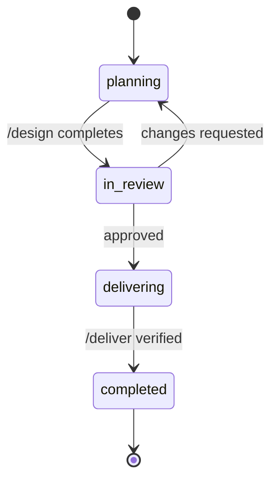

# Specs & Lifecycle

Specs are Hero's fundamental unit of work. They live as markdown files with YAML frontmatter, tracked by status and synced with external issue trackers.

## Spec Types

| Type | Purpose | Created by |
|---|---|---|
| `feature` | New functionality or enhancement | `/design`, `/compose` |
| `bug` | Defect investigation and fix plan | `/diagnose` |
| `initiative` | High-level epic broken into child specs | `/compose` |

## Frontmatter Schema

Every spec includes YAML frontmatter:

```yaml
---
title: Add CSV export to reports
type: feature
status: in-review
tracker_id: PROJ-1234
priority: high
severity: null          # bugs only
# Jira
jira_status: In Progress
jira_priority: High
jira_assignee: chet-bellows
---
```

The fields under the tracker comment header (e.g. `# Jira`, `# Github`, `# Linear`) are synced from the external tracker and should not be edited manually.

## Spec Lifecycle



| Status | Meaning |
|---|---|
| `planning` | Being drafted or revised |
| `in-review` | Awaiting human approval |
| `delivering` | Implementation in progress |
| `completed` | Delivered and verified |

!!! warning "Never work on closed items"
    Commands like `/diagnose` and `/deliver` check tracker status before starting. If the issue is closed upstream, Hero refuses to start work.

## File Locations

```
.hero/
├── planning/           # Active specs (status: planning → delivering)
│   ├── add-csv-export.md
│   └── fix-auth-timeout.md
└── specs/              # Completed specs (archive)
    ├── user-registration.md
    └── fix-null-pointer.md
```

Specs move from `planning/` to `specs/` when they reach `completed` status.

## Convention Lifecycle

Conventions (defined via `/convention`) follow a separate lifecycle:

| Status | Meaning |
|---|---|
| `draft` | Proposed, not yet enforced |
| `active` | Enforced during `/deliver` and `/review` |
| `superseded` | Replaced by a newer convention |

## Decision Lifecycle

Architectural decisions (defined via `/decide`) follow:

| Status | Meaning |
|---|---|
| `proposed` | Under discussion |
| `accepted` | Ratified and in effect |
| `superseded` | Replaced by a later decision |

!!! tip "Searching specs"
    Use `hero search <query>` to find specs by keyword, or `hero search --list --type bug` to list all bug specs locally.
