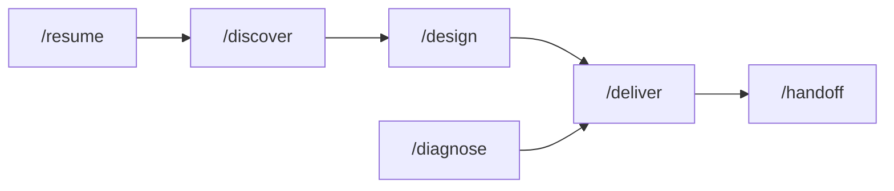

# Hero

**Design before you build. Diagnose before you fix. Start every session warm.**

Hero is the sidekick brain for AI-augmented engineering. It captures
specs, decisions, conventions, acceptance criteria, attempts, failures,
and recent activity into a local `.hero/` corpus, then exposes that
context to AI coding tools through slash commands, CLI commands, and MCP.



## Just tell it what you want

You don't have to memorize commands. Describe what you need in plain
English and Hero routes it to the right workflow:

| You say... | Hero runs |
|---|---|
| "There's a bug in checkout, can you investigate?" | `/diagnose` |
| "Let's add CSV export to the reports page" | `/design` |
| "Ship the auth spec" | `/deliver` |
| "Review this PR" | `/review` |
| "Break this epic into smaller pieces" | `/compose` |
| "What's the convention for error handling here?" | `/convention` |
| "Help me decide between Postgres and SQLite" | `/decide` |
| "Where did we leave off?" | `/resume` |

Slash commands and the CLI are always there when you want precision —
but day to day, conversation is the interface.

## Why Hero?

- **Specs before code** — `/design` produces an explicit plan and
  acceptance criteria before implementation.
- **Diagnosis before fixes** — `/diagnose` investigates root cause and
  creates a fix spec instead of guessing.
- **Context compounds** — `/resume`, `hero search`, `hero ask`,
  `hero relevant`, and MCP tools make prior work available to the next
  session.
- **Knowledge becomes structure** — the graph backs `hero why`,
  `hero blocked`, AC status, drift checks, and session handoff.
- **The harness stays the brain** — Hero feeds OpenCode, Cursor, Claude
  Code, Codex, Copilot, and MCP-capable tools with the right context.

Current installed surfaces: 27 slash commands, 34 agents, 45 skills, and
41 MCP tools.

## Quick Start

```bash
# macOS / Linux
brew install hero-engine/tap/hero
# Linux (no Homebrew): curl -fsSL https://raw.githubusercontent.com/hero-engine/hero-releases/main/install.sh | sh
# Windows: scoop bucket add hero-engine https://github.com/hero-engine/scoop-bucket && scoop install hero

cd your-project
hero init
hero install project . --target opencode
```

See the [installation guide](getting-started/installation.md) for all options.

Then in your AI tool:

```text
/scan
/resume
/design add CSV export
```

## Core Workflows

| Workflow | Commands | Purpose |
|---|---|---|
| Build | `/discover` -> `/design` -> `/deliver` | Explore, spec, implement. |
| Fix | `/diagnose` -> `/deliver` | Investigate, spec fix, implement. |
| Maintain | `/convention`, `/scrub`, `/review`, `/check` | Standards, cleanup, review, health. |
| Coordinate | `/compose`, `/sprint`, `/handoff`, `hero queue` | Plan, sequence, preserve context. |

## Next Steps

- [What Is Hero?](what-is-hero.md) — plain-English explainer
- [Why Hero](why-hero.md) — deeper technical evaluation
- [Installation](getting-started/installation.md)
- [Project Setup](getting-started/project-setup.md)
- [First Workflow](getting-started/first-workflow.md)
- [Commands Reference](commands/index.md)
- [CLI Overview](cli/overview.md)
- [MCP Setup](configuration/mcp-setup.md)
