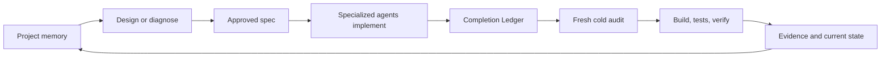

# Verified delivery

Hero's delivery system uses project memory to move bounded work from intent to
tested completion. Specs are the execution mechanism; durable project memory is
the product's primary context layer.

## The delivery path



### 1. Bound intent

- `/design` produces a feature or platform spec.
- `/diagnose` investigates a defect and produces a fix spec.
- The spec states its goal, changes, acceptance criteria, validation, and
  boundaries before implementation begins.

### 2. Implement with relevant context

`/deliver <slug>` loads the approved spec and retrieves applicable conventions,
decisions, past work, and known risks. The Engineering setup routes bounded work
to specialized agents supported by the active harness.

### 3. Account for every requirement

The implementing agent writes a Completion Ledger with one row for every
acceptance criterion and every Changes item. `DONE` requires on-disk evidence
and an end-to-end exercise for user-visible behavior.

### 4. Audit cold

A fresh agent that did not implement the change checks the spec, diff, ledger,
and test evidence. A `HOLD` verdict returns concrete concerns to implementation;
only `SHIP` proceeds.

### 5. Verify once

```bash
hero spec verify <slug>
```

Verification checks:

1. Completion Ledger status
2. Cold delivery audit with a `SHIP` verdict
3. Acceptance-criterion-to-test coverage
4. Configured build and tests

When the hard gates pass, the command marks the spec complete and archives it.
Do not run `hero spec complete` as a second normal closing step and do not edit
`status: completed` manually.

## Availability and prerequisites

Verified delivery is **shipped** with the Engineering setup. It requires an
active harness capable of running the installed agents, a delivery workflow,
and a project with meaningful validation. The gates establish recorded
evidence; they do not guarantee correctness or eliminate human supervision.

Next: [Continuity](continuity.md) explains how decisions and evidence inform
later sessions and keep the reinforcing loop moving.
