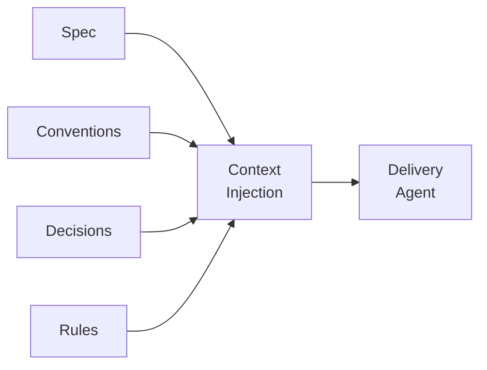

# Knowledge Base

Hero's knowledge base is a local, queryable store of project knowledge that agents use to make better decisions. It lives in `.hero/knowledge/` and grows organically as you work.

## Structure

```
.hero/knowledge/
├── conventions/    # How we write code (style, patterns, practices)
├── decisions/      # ADRs — why we chose X over Y
├── rules/          # Hard constraints (security, compliance, performance)
├── context/        # Project background (architecture, domain model)
├── notes/          # Brainstorms, ideas, rough thoughts
└── templates/      # Reusable spec and document templates
```

## Knowledge Types

| Type | Purpose | Example |
|---|---|---|
| **Conventions** | Coding standards and patterns | "All API handlers return `Result<T>` types" |
| **Decisions** | Architectural decision records | "Chose Postgres over DynamoDB for transactional consistency" |
| **Rules** | Non-negotiable constraints | "No secrets in environment variables; use Vault" |
| **Context** | Background information | "The billing service was extracted from the monolith in Q3" |
| **Notes** | Informal captures | "Brainstorm: possible migration to gRPC" |
| **Templates** | Scaffolds for specs and docs | Feature spec template, ADR template |

## Auto-Capture

When `knowledge.auto_capture` is enabled in `hero.json`, agents silently persist learnings at the end of major workflows:

```json
{
  "knowledge": {
    "auto_capture": true
  }
}
```

!!! info "What gets captured"
    After a `/deliver` or `/diagnose` cycle, the agent evaluates whether it encountered novel patterns, gotchas, or architectural insights. If so, it writes them to the appropriate knowledge directory — no prompt required.

## Querying

Use `hero ask` or `hero search` to query the knowledge base:

```bash
hero ask "how do we handle authentication"
hero search --hybrid "retry logic for failed requests"
```

Search uses **BM25/TF-IDF** ranking by default. With `--hybrid`, Hero
fuses lexical results with semantic vector similarity — so a query about
"login failure backoff" finds a spec titled "Authentication Retry Logic"
even without keyword overlap. The embedding model ships inside the `hero`
binary; no download, no external service, no LLM call.

## Context Injection

During `/deliver`, Hero automatically injects relevant knowledge into the agent's context:



The delivery agent receives the spec plus any conventions, decisions, and rules that are relevant to the work at hand. This means agents follow your standards without being told each time.

## Tripwire guardrails

Conventions aren't only about how to write code — they can also encode what
**not** to do. Hero supports **tripwire entries**: knowledge that marks a path
as forbidden because it was already tried and ruled out.

When Hero injects context into an agent session, tripwires surface as explicit
constraints:

> "We evaluated approach X and ruled it out because Y — do not revisit."

This prevents agents from confidently proposing solutions that the team already
rejected, and it prevents the same investigation from happening twice. Use
`/decide` to record the ruled-out option alongside the chosen one, or write
a `rules/` entry directly with a `forbidden:` marker.

```bash
# Record a decision with the rejected alternative captured
/decide "chose outbox pattern over direct webhook delivery — direct delivery failed under load in Feb"
```

### Spec scoring and sizing

The knowledge base also reflects spec health. `hero check`
surface specs whose declared `size:` has drifted from their actual complexity,
or that are oversized for their type. This sizing guidance flows into context
injection — agents working on a `large` or `x-large` spec receive a nudge to
consider splitting before starting implementation.

!!! tip "Building the knowledge base"
    You don't need to populate everything upfront. Use `/convention` to define standards as they come up, `/decide` to record choices when you make them, and `/note` to capture thoughts as you have them. The knowledge base compounds over time.
